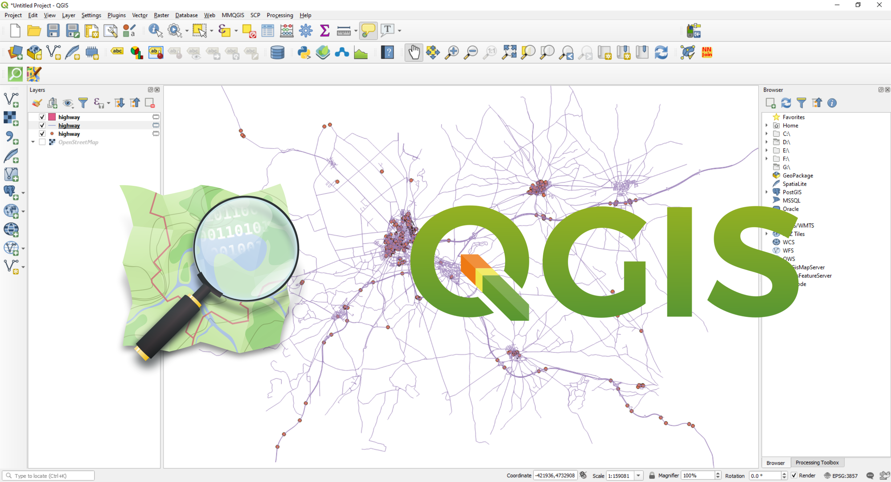

```{r xaringan-themer, include=FALSE, warning=FALSE}
# Utilizando o  css: xaringan-themer.css
# Podemos personalizar
# https://cran.r-project.org/web/packages/xaringanthemer/vignettes/xaringanthemer.html

library(xaringanthemer)

# style_duo_accent(
#   primary_color = "#1381B0",
#   secondary_color = "#FF961C",
#   inverse_header_color = "#FFFFFF"
# )

style_mono_accent(
  base_color = "#43418A",
  header_font_google = google_font("Josefin Sans"),
  text_font_google   = google_font("Montserrat", "300", "300i"),
  code_font_google   = google_font("Fira Mono")
)

# style_mono_accent(base_color = "#1c5253")
# style_mono_light(base_color = "#23395b")

```

```{r, include=FALSE}
options(htmltools.dir.version = FALSE)
knitr::opts_chunk$set(
  fig.width=9, fig.height=3.5, fig.retina=3,
#  out.width = "100%",
  cache=TRUE,
  prompt=FALSE,
  tidy=TRUE,
  comment=NA,
  message=FALSE,
  warning=FALSE,
  cache.lazy=FALSE,
  echo = TRUE,
  hiline = TRUE
)

# https://www.kirenz.com/slides/xaringan-demo-slides.html#40
# https://www.garrickadenbuie.com/talk/extra-special-xaringan/
# https://pkg.garrickadenbuie.com/xaringanExtra/#/README?id=xaringanextra
```

<!-- layout: true -->
<!-- <div style="position: absolute;right:50px;top:11px;color:gray;">`r rmarkdown::metadata$author` - `r rmarkdown::metadata$institute`</div> -->


```{r xaringan-tile-view, echo=FALSE}
 xaringanExtra::use_tile_view()
```


```{r  adds a share bar to your slides, echo=FALSE}
xaringanExtra::use_share_again()
```

```{r xaringan-scribble, echo=FALSE}
xaringanExtra::use_scribble()
```

```{r xaringan-panelset, echo=FALSE}
xaringanExtra::use_panelset()
```

```{r style-share-again, echo=FALSE}
xaringanExtra::style_share_again(
  share_buttons = c("twitter", "linkedin", "pocket")
)
```

```{r xaringanExtra-clipboard, echo=FALSE}
htmltools::tagList(
  xaringanExtra::use_clipboard(
    button_text = "<i class=\"fa fa-clipboard\"></i>",
    success_text = "<i class=\"fa fa-check\" style=\"color: #90BE6D\"></i>",
    error_text = "<i class=\"fa fa-times-circle\" style=\"color: #F94144\"></i>"
  ),
  rmarkdown::html_dependency_font_awesome()
)
```

```{r xaringanExtra, echo=FALSE}
xaringanExtra::use_xaringan_extra(c("tile_view", "panelset", "editable", 
    "slide_tone", "animate", "tachyons"))
```

```{r xaringan-animate-all, echo=FALSE}
xaringanExtra::use_animate_all("roll")
```


```{r, echo=FALSE}
## Color Format
colFmt <- function(x,color) {
  
  outputFormat <- knitr::opts_knit$get("rmarkdown.pandoc.to")
  
  if(outputFormat == 'latex') {
    ret <- paste("\\textcolor{",color,"}{",x,"}",sep="")
  } else if(outputFormat == 'html') {
    ret <- paste("<font color='",color,"'>",x,"</font>",sep="")
  } else {
    ret <- x
  }

  return(ret)
}
```


```{r - Packages, echo=FALSE}
library(readr)
library(tidyverse)
library(ggplot2)
library(pander)
library(xaringanExtra)
library(mfx)
library(kableExtra)
library(knitr)

```

```{r xaringan-extra, echo=FALSE}
xaringanExtra::use_logo("logorural.jpg", width="100px")
```

---

# Apresentação

Essa aplicação também se encontra no [Curso de Estudos
    Ecológicos](https://ogcruz.github.io/) ministrado para o curso de
    [Pós-Graduação em Epidemiologia em Saúde
    Pública](http://ensino.ensp.fiocruz.br/cursos/mestrado-e-doutorado/epidemiologia-em-saude-publica)
    em 2019, pelos pesquisadores [Oswaldo Gonçalves Cruz
    (PROCC/FIOCRUZ)](https://lsbastos.github.io/PROCC/membro-9530671289607786.html)
    e [Wagner Tassinari
    (DEMAT/ICE/UFRRJ)](https://institucional.ufrrj.br/ruralpesquisa/wagner-de-souza-tassinari/)
    
---

# Delineamentos Ecológicos

## O que são Estudos Ecológicos ?

- São estudos nos quais a unidade de análise (ou agregação) é uma população ou um grupo de pessoas, geralmente de uma área geográfica definida (ex: um país, um estado, uma cidade, etc.), em um determinado tempo definido.

- **Definição Clássica:** é um estudo observacional com a informação obtida e analisada no nível agregado.

- Geralmente são mais baratos e mais rápidos do que estudos envolvendo o indivíduo como unidade de análise.

- Procuram avaliar como os contextos (sociais, ambientais, etc) podem afetar a saúde de grupos populacionais.


---

# Introdução às Séries Temporais

## O que são Séries Temporais ?

-   Definição: Entende-se por Séries Temporais (ST) todo e qualquer
    conjunto de dados (absolutos ou relativos, discretos ou contínuos),
    ordenados cronologicamente.

-   Condição: Esses dados seguem uma ordenação em função do tempo
    (dependência temporal).

---

# Alguns exemplos de séries temporais


```{r echo=F, fig.align="center", out.width= "60%", fig.show='hold'}
knitr::include_graphics('figuras/ST1.png')
```

---

# Aplicações

|                                                                      Exemplos                                                                      |                                                 Objetivos                                                 |
|:--------------------------------------------------------------------------------------------------------------------------------------------------:|:---------------------------------------------------------------------------------------------------------:|
| **Descrição:** Verificar existência de tendência, sazonalidade, ciclos. Histogramas,  boxplots, são ferramentas da análise exploratória descritiva | Identificar tendência da AIDS; sazonalidade da dengue visando estabelecer melhor  período de intervenção. |
| **Estabelecimento de causalidade:** Estudo da relação de causa-efeito                                                                              |                         Vacina X sarampo; Mortalidade por DIC X melhor assistência                        |
| **Classificação:** Identificação de padrões                                                                                                        |                         A série de leishmaniose tegumentar é “igual” à visceral ?                         |
| **Monitoramento:** Detectar variações no comportamento da séries temporais conforme elas ocorram                                                   |                              Dosagem de Hormônios ou de sinais vitais em CTI                              |
| **Predição (forecast):** Prever o comportamento futuro de uma série                                                                                |                                           Predição de epidemias                                           |
| **Atualização (nowcast):** Predição sobre o presente                                                                                               |                                      Corrigir atraso de notificações                                      |
|                                                                                                                                                    |                                                                                                           |
---

# Estacionariedade

-   Uma série temporal é dita estacionária quando ela se desenvolve no
    tempo aleatoriamente ao redor de uma média constante e com uma
    variância constante, refletindo alguma forma de equilíbrio estável.
    
```{r echo=F, fig.align="center", out.width= "100%", fig.show='hold'}
knitr::include_graphics('figuras/ST2.png')
```

---

# Tendência

-   É a indicadora da direção global dos dados (ou movimento geral da
    variável), do percurso traçado e de sua linha contínua.
    
```{r echo=F, fig.align="center", out.width= "60%", fig.show='hold'}
knitr::include_graphics('figuras/ST3.png')
```


---

# Ciclo

* Os ciclos são oscilações (aproximadamente regulares) em torno da tendência. Podem dever-se a fenômenos naturais, socioculturais ou econômicos, como variações climáticas (ex: excesso ou falta de chuva pode produzir ciclos agrícolas)

* Variações que apesar de periódicas não são associadas automaticamente a nenhuma medida do calendário;

* Aumento ou redução de frequência sem intervalos fixos.

**Ex:** Ciclos Econômicos e Ciclos de epidemias.

```{r echo=F, fig.align="center", out.width= "45%", fig.show='hold'}
knitr::include_graphics('figuras/ST5.png')
```

---

# Sazonalidade

* São ciclos de curto prazo (não maiores que um ano), em torno da tendência;

* Costumam se referir a eventos ligados a estação do ano, vinculados ao calendário e geralmente repetidos a cada doze meses;

* Efeitos ligados à variações periódicas (semanal, mensal, anual, etc.);

* Padrões que ocorrem em intervalos fixos.

**Ex:** Medidas de Temperatura (aumenta no verão e diminui no inverno).

```{r echo=F, fig.align="center", out.width= "50%", fig.show='hold'}
knitr::include_graphics('figuras/ST4.png')
```

---

# Sazonalidade

* A diferença entre os ciclos, propriamente ditos, e a sazonalidade é o período de avaliação (curto e longo);

* A semelhança é que ambos definem oscilações relativamente regulares em torno da tendência.

* Na área de saúde é pouco comum encontrarmos ciclos, ainda que possam existir.


---

# Termo Aleatório ou Ruído Branco

* Conceitualmente, a componente aleatória é uma mistura de pertubações bruscas, irregulares e esporádicas nos movimentos das séries que tipificam os fenômenos. Na realidade é resultante dos efeitos de múltiplas causas que dificilmente/não conseguem ser previstos.

- **Exemplos típicos de eventos aleatórios:** Secas, Enchentes, Terremotos, Ocorrência de epidemias, Crise política, etc.

---

# Componentes de uma Série Temporal

```{r echo=F, fig.align="center", out.width= "60%", fig.show='hold'}
knitr::include_graphics('figuras/ST6.png')
```

```{r echo=F, fig.align="center", out.width= "80%", fig.show='hold'}
knitr::include_graphics('figuras/ST7.png')
```

---

# Pressuposto da Independência 

* Os métodos usuais de análise estatística de dados têm como pressuposto básico a independência dos eventos (casos). Ou seja, a ocorrência de um caso de doença em uma dada pessoa seria independente da ocorrência em outra pessoa.

* Pressupostos básicos para uma análise de regressão:

  * $E(e_i)=0$
  
  * Variância $\sigma^2$ constante (homocedasticidade)
  
  * $e_i \sim N(0, \sigma^2)$
  
  * $e_i \neq e_j$, são independentes

* Na análise da incidência de doenças (ou qualquer outro indicador ecológico) ao longo do tempo isso não é verdade: a incidência em um determinado dia/mês ou ano em geral é correlacionada com a ocorrência no dia/mês/ano anterior.

* Esta correlação é expressa em uma função denominada função de autocorrelação - FAC (*Autocorrelation function - ACF*).

---

# Função de Autocorrelação - FAC

* O correlograma é uma das principais ferramentas de análise exploratória em séries temporais, pois indica como cada valor em um dado instante de tempo $t$ se relaciona com os valores em $t+1, t+2, \dots t+j$. Sendo $H_0 : \rho_h = 0$

```{r echo=F, fig.align="center", out.width= "45%", fig.show='hold'}
knitr::include_graphics('figuras/ST9.png')
```

---

# Transformações e Suavizações

- As transformações e as funções de alisamento (suavização) em séries temporais são normalmente empregados para nos ajudar a ver melhor os padrões existentes - tais como as tendências e sazonalidade - e suavizar as oscilações irregulares (ruídos) para que possamos obter uma série mais limpa com um sinal mais claro.

- Estas técnicas não nos fornecem um modelo, mas podem ser um bom primeiro passo na descrição para os vários componentes da série.

- **Algumas técnicas de transformação:** Funções Logarítmicas, Potências, Exponenciais, ou transformação Box-Cox.


- **Algumas técnicas de suavização:** Médias Móveis, Kernel, Loess/Lowess, Splines e Generalized Additive Model (GAM).

```{r, echo=F, fig.align="center",  out.width="70%"}
library(forecast)
plot(UKDriverDeaths, ylab='',main="Mortes em estradas no Reino Unido (1969–1984)")
lines(ma(UKDriverDeaths,12),col=2,lty=1,lwd=2)
lines(ma(UKDriverDeaths,4),col=4,lty=2,lwd=2)
legend("topright",legend=c("Óbitos","Média Móvel 4","Média Móvel 12"),
       col = c("black",'blue','red'), lty=c(1,2,1), cex=1)

```

---

# Tipo de Série Temporal

* A série pode ser descrita como sendo a soma ou multiplicação dos componentes (tendência, sazonalidade, ciclicidade - se houver - e termo aleatório).

$$Z_t = T_t + S_t + a_t$$

$$Z_t = T_t \times S_t \times a_t$$

```{r echo=F, fig.align="center", out.width= "80%", fig.show='hold'}
knitr::include_graphics('figuras/ST8.png')
```

---

# Modelos ARIMA

- O método criado por Box & Jenkins envolve a identificação de um processo ARIMA (modelos autorregressivos, integrados e de médias móveis) adequado, ajustando-o aos dados e, uma vez ajustados permite também utilizar esses modelos para a descrição e/ou previsão (forecast).

- Uma das características atraentes da abordagem Box-Jenkins é que os processos ARIMA são uma classe muito rica de modelos e geralmente é possível encontrar um modelo que forneça uma descrição adequada dos dados. Ajustam simultaneamente tendência, sazonalidade, ciclicidade e estrutura de dependência serial.


---
  
## Aplicação: Mortes mensais por doenças pulmonares no Reino Unido
  
#### Série Bruta
  
```{r, echo=F,  out.width="100%"}
library(dygraphs)
dygraph(ldeaths) %>% dyRangeSelector()

```

---
  
## Aplicação: Mortes mensais por doenças pulmonares no Reino Unido
  
#### ST brutas por sexo
  
```{r, echo=F,  out.width="100%"}
library(dygraphs)
lungDeaths <- cbind(mdeaths, fdeaths)

dygraph(lungDeaths) %>%
  dySeries("mdeaths", label = "Male") %>%
  dySeries("fdeaths", label = "Female") %>%
  dyOptions(stackedGraph = TRUE) %>%
  dyRangeSelector(height = 20)

```

---
  
## Aplicação: Mortes mensais por doenças pulmonares no Reino Unido
  
#### Decompondo a ST
  
```{r, echo=F,  out.width="100%"}
autoplot(decompose(ldeaths)) +
  theme_bw()

```

---
  
## Aplicação: Mortes mensais por doenças pulmonares no Reino Unido
  
#### Verificando a sazonalidade
  
```{r, echo=F,  out.width="100%"}
ggseasonplot(ldeaths, year.labels=TRUE, year.labels.left=TRUE) +
  ylab(" ") +
  ggtitle("Seasonal plot") +
  theme_minimal()

```

---
  
## Aplicação: Mortes mensais por doenças pulmonares no Reino Unido
  
#### ACF
  
```{r, echo=F,  out.width="100%"}
acf(ldeaths, lag.max=20, main="Função de Autocorrelação")

```

---
  
## Aplicação: Mortes mensais por doenças pulmonares no Reino Unido

#### Utilizando o modelo ARIMA
  
```{r, echo=F,  out.width="100%"}

# Utilizando trace = T, será possível verificar todo o processo de criação e teste dos modelos
modelo1 <-  auto.arima(ldeaths, trace = F, allowdrift=F)
pred <- forecast(modelo1,h=24)
plot(pred, main = "Série Temporal Bruta + Previsão 24 meses")
```

---
  
## Aplicação: Mortes mensais por doenças pulmonares no Reino Unido

#### Predição para 5 anos
  
```{r, echo=F,  out.width="100%"}
hw <- HoltWinters(ldeaths)
predicted <- predict(hw, n.ahead = 60, prediction.interval = TRUE)

dygraph(predicted, main = "Predicted Lung Deaths (UK)") %>%
  dyAxis("x", drawGrid = FALSE) %>%
  dySeries(c("lwr", "fit", "upr"), label = "Deaths") %>%
  dyOptions(colors = RColorBrewer::brewer.pal(3, "Set1"))
```


---

# Introdução à Análise Estatística Espacial

## O que é Análise Estatística Espacial ?

-   São métodos estatísticos que levam em consideração a localização
    espacial do fenômeno estudado;

-   Segundo Bailey & Gatrell (1995), *"Análise estatística espacial pode
    ser realizada quando os dados são espacialmente localizados e se
    considera explicitamente a possível importância de seu arranjo
    espacial na análise ou interpretação dos resultados"*

---

## Origem da Estatística Espacial

-   Dr. John Snow (1813-1858) $\rightarrow$ Considerado pai da
    Epidemiologia Moderna

```{r echo=F, fig.align="center", out.width= "60%", fig.show='hold'}
include_graphics('figuras/snow2_2019.png')
```

Mapeamento dos casos de cólera ($\bullet$) e as bombas de água (X) em
Londres, 1854.

---

## Objetivos da Estatística Espacial

1)  Análise de padrões espaciais e espaço-temporais (ex: Análise
    Exploratória Espacial, Correlação Espacial)

2)  Modelagem Espacial (ex: Modelos Estatísticos de Regressão Espacial) 
    
    
---

## Dependência Espacial ou Autocorrelação Espacial

-   *"Todas as coisas se parecem, coisas mais próximas são mais
    parecidas que aquelas mais distantes."* (Tobler, 1979).
     `r colFmt("Também conhecida como $1^a$ Lei da Geografia",'red')`
    
---

## Tipologia dos Dados Espaciais

Os diferentes tipos de dados espaciais são tradicionalmente
classificados de acordo com uma tipologia. Esta caracterização diz
respeito a natureza estocástica da observação.


```{r echo=F, fig.align="center", out.width= "85%", fig.show='hold'}
include_graphics('figuras/slide4.jpg')

```

---

## Padrões Pontuais

- O principal interesse está no conjunto de coordenadas geográficas
    representando as localizações exatas de eventos.

- Exemplos: Localização de crimes, localização da residência dos casos
    de dengue, localização de espécies vegetais, etc.

```{r echo=F, fig.align="center", message=FALSE, warning=FALSE, comments=NA, out.width="25%", comment=NA}
knitr::include_graphics('figuras/coordenadas.png')
```

```{r echo=F, fig.align="center", message=FALSE, warning=FALSE, comments=NA, out.width="55%", comment=NA}
knitr::include_graphics('figuras/pontos1.jpg')
```

---

## Estimativas de Kernel (ou Mapas de Calor)

#### Exemplo: Localização da ocorrência de casos de dengue em Belo Horizonte/MG

```{r echo=F, fig.align="center", out.width= "45%", fig.show='hold'}

```


---

## Geoestatística

- Podemos definir como sendo uma análise de um atributo espacialmente
    contínuo amostrado em localizações fixas.

- Os dados compreendem um conjunto de localizações (em geral latitudes
    e longitudes), mas atribuidos a eles uma medida.
    
- Exemplos: volume de chuva, concentração de poluentes no ar, número de ovos de
    Aedes postado em ovitrampas, etc.

---

## Krigagem

#### Exemplo: Mapa sobre o teor de argila no solo.

```{r echo=F, fig.align="center", out.width= "90%", fig.show='hold'}

```

---

## Dados de Área

- Na análise de áreas o atributo estudado é em geral resultado de uma
    contagem ou uma medida de síntese (em geral somas ou médias) em uma
    determinada área bem definida, por exemplo um polígono.

- Tal polígono cuja forma pode ser complexa bem como as relações de
    vizinhança.

- O objetivo é a detecção e explicação de padrões e tendências
    observados entre áreas.

---

### Mapa Temático

#### Exemplo: Porcentagem de municípios com rede de esgoto de acordo com a unidade da federação

```{r, echo=F,  out.width="100%"}
# Bibliotecas
library(readr)
library(tidyverse)
library(sf)
library(maptools)
library(spatstat)
library(tmap)

library(ggplot2)
library(dplyr)
library(viridis)
library(geobr)
library(leaflet)
library(ggspatial)

library(plotly)
```


```{r, echo=F, out.width= "100%", }
brasil.ufs <- read_state(code_state = "all", year=2019, showProgress = FALSE)

acesso_san <- data.frame(code_state = c(12, 27, 16, 13, 29, 23, 53, 32, 52, 21, 51, 50, 31, 15, 
                                   25, 41, 26, 22, 33, 24, 43, 11, 14, 42, 35, 28, 17), 
                         com_rede = c(0.273, 0.412, 0.313, 0.177, 0.513, 0.696, 1.000, 0.974, 0.280, 0.065, 
                                      0.191, 0.449, 0.916, 0.063, 0.731, 0.421, 0.881, 0.045, 0.924, 0.353, 
                                      0.405, 0.096, 0.400, 0.352, 0.998, 0.347, 0.129))

brasil.ufs <- brasil.ufs |> 
  left_join(acesso_san, by = "code_state") |> 
  mutate(com_rede = 100*com_rede) 

map1 <-  ggplot(brasil.ufs, aes(fill = com_rede), color = "black") +
    geom_sf() + 
    scale_fill_viridis(name = "Rede de esgoto (%)", direction = -1) + 
  xlab("Longitude") + 
  ylab("Latitude") +
  annotation_scale(location = "bl") +
  annotation_north_arrow(location = "br") +
    theme_minimal()

ggplotly(map1)

```


---

## Moran Global, Moran Local e Lisa Map

#### Exemplo: Desigualdade no nível distrital na cobertura de saúde reprodutiva, materna, neonatal e infantil na Índia

```{r echo=F, fig.align="center", out.width="75%"}

```

[Fonte: Panda et al., 2020](https://bmcpublichealth.biomedcentral.com/articles/10.1186/s12889-020-8151-9)

---

## Modelos de Regressão Espacial

-   `r colFmt(" Hipótese de independência das observações em geral é Falsa ",'orange')`
    $\rightarrow$ Dependência Espacial

-   Efeitos Espaciais $\rightarrow$ Se existir forte tendência ou
    correlação espacial, os resultados serão influenciados, apresentando
    associação estatística onde não existe (e vice-versa);

-   `r colFmt("**Como verificar ?** ",'darkred')` $\rightarrow$ Medir a
    autocorrelação espacial dos resíduos da regressão (Índice de Moran
    dos resíduos).

-   Autocorrelação espacial constatada ! E agora ? $\rightarrow$
    Utilizar Modelos de regressão que incorporam efeitos espaciais:

---

## Modelos de Regressão Espacial

i)  **Modelos Globais:** utilizam um único parâmetro para capturar a
        estrutura de correlação espacial $\rightarrow$ ex: *Spatial
        Error Models (CAR)*

$$y_i = \beta_0 + \sum^{p}_{k} \beta_k x_{ik}  + \varepsilon_i \text{    , sendo  }  \varepsilon_i = \lambda  W + \xi$$

- Os efeitos da autocorrelação espacial são associados ao termo de
    erro. Sendo $W$ a matriz de vizinhaça, $\varepsilon$ a componente do
    erro com efeitos espaciais, $λ$ é o coeficiente autoregressivo e
    $\xi$ é a componente do erro com variância constante e não
    correlacionada.

- A hipótese nula para a não existência de autocorrelação é que
    $\lambda = 0$, ou seja, o termo de erro não é espacialmente
    correlacionado.

ii) **Modelos Locais:** parâmetros variam continuamente no espaço
        ex: *Geographically Weighted Regression (GWR)*

$$y_i = \beta_{0}(u_i, v_i) + \sum^{p}_{k}  \beta_k (u_i, v_i) x_{ik} + \varepsilon_i \text{    , sendo  } (u_i, v_i) \text{    as coordenadas geográficas}$$

[Fonte: ARDILLY, Pascal et al. Manuel d'analyse spatiale. 2018.](https://ec.europa.eu/eurostat/documents/3859598/9462709/INSEE-ESTAT-SPATIAL-ANA-18-EN.pdf)


---

## Ferramentas para análise estatística espacial:

### SiG QGIS

```{r echo=F, fig.align="center", out.width="60%"}

```

[QGIS: Um Sistema de Informação Geográfica livre e
aberto](https://www.qgis.org/pt_BR/site/)

---

## Ferramentas para análise estatística espacial:

### GEODA

```{r echo=F, fig.align="center", out.width="70%"}
knitr::include_graphics('figuras/GEODA.png')
```

[GEODA: AN INTRODUCTION TO SPATIAL DATA
ANALYSIS](https://spatial.uchicago.edu/geoda)

---

## Ferramentas para análise estatística espacial:

### SatScan

```{r echo=F, fig.align="center", out.width="60%"}

```

[SatScan: A free software that analyzes spatial, temporal and space-time](https://www.satscan.org/)

---

## Ferramentas para análise estatística espacial:

### R

```{r echo=F, fig.align="center", out.width="50%"}
knitr::include_graphics('figuras/logo_ubuntu.png')
```

Fonte: [Dicas para integração e instalação do R 4.0 no Ubuntu 20.04 LTS
e os pacotes
espaciais](https://rtask.thinkr.fr/installation-of-r-4-0-on-ubuntu-20-04-lts-and-tips-for-spatial-packages/)


---

## Aplicação: Análise exploratória utilizando os dados de dengue em Dourados/MS
  
-   Nesta apresentação serão utilizados os dados que fizeram parte da dissertação de [Isis Rodrigues                Reitman](https://sucupira.capes.gov.br/sucupira/public/consultas/coleta/trabalhoConclusao/viewTrabalhoConclusao.jsf?popup=true&id_trabalho=3666174) intitulada *"SAÚDE E AMBIENTE URBANO: A RELAÇÃO DE INCIDÊNCIA DE
    DENGUE E AS DISPARIDADES ESPACIAIS EM DOURADOS - MS"*, apresentada no [Programa de Pós-Graduação em Geografia da Universidade Federal da Grande Douradosos/MS](https://portal.ufgd.edu.br/pos-graduacao/mestrado-doutorado-geografia/index), em abril de 2016.


```{r, echo=F}
# Lendo a tabela da população por setor censitário e os shapes files
#    do contorno e por setor censitário de Dourados/MS
unzip('dados/pop2010.zip', exdir='dados')
pop2010 <- read_csv('dados/pop2010.csv')

unzip('malhas/Setor_UTM_SIRGAS.zip', exdir='malhas')
setor.sf <- read_sf('malhas/Setor_UTM_SIRGAS.shp', crs = 31981)

unzip('malhas/contorno.zip', exdir='malhas')
contorno.sf <- read_sf('malhas/contorno.shp', crs = 31981)

```    


```{r, echo=F}
# Fazendo um join com as tabelas com os setores censitários +
#    população
setor.sf <- setor.sf %>% mutate (idsetor = as.numeric(CD_GEOCODI)) %>% inner_join(pop2010,by='idsetor')
```


```{r, echo=F}
# Lendo e plotando os casos de dengue georreferenciados em Dourados/MS
unzip('dados/dengue_dourados.zip', exdir='dados')
casos <- read_csv('dados/dengue_dourados.csv')
casos.sf <- st_as_sf(casos, coords = c("X", "Y"), crs = 31981)
``` 


```{r, echo=F,  out.width="100%"}
# Lendo e plotando os os pontos de coleta de lixo georreferenciados em
#    Dourados/MS
unzip('dados/lixo_dourados.zip', exdir='dados')
lixo <- read_csv2('dados/lixo_dourados.csv')
lixo.sf <- st_as_sf(lixo, coords = c("X", "Y"), crs = 31981)

# ficarmos só com os pontos dentro do polígono
lixo2.sf <- st_intersection(contorno.sf, lixo.sf)

# buffers 500m
lixo_buffer <- st_buffer(lixo2.sf, 500)
```    


---
  
## Representação da distribuição dos casos georreferenciados
  
```{r, echo=F,  out.width="100%"}
tm_shape(setor.sf) +  tm_borders("black") +
  tm_shape(casos.sf) + tm_dots("red") +
  tm_shape(lixo.sf) + tm_dots("green") +
  tm_shape(lixo_buffer) + tm_borders("blue") +
  tmap_mode("view")

```

---
  
## Kernel da incidência de dengue

### Kernel da taxa de incidência de dengue com a largura de banda de 500m

```{r, echo=F}

## Convertendo o dado de pontos (padrão pontual) para dados de área
## conta casos por setor 
casos.sf$contador <- 1 
casos <- setor.sf |>  
  st_join(casos.sf) |> 
  filter(CLASSI_FIN == 1) %>%  ## seleciona somente os casos confirmados
  group_by(ID) |> 
  summarise(casos = sum(contador))

st_geometry(casos) <- NULL  ## remove atributos de geometria

## numero de depositos de Lixo por setor 
lixo.sf$contador <- 1 

lixo <- setor.sf |>  
  st_join(lixo.sf) |> 
  group_by(ID) |> 
  summarise(lixo = sum(contador))

st_geometry(lixo) <- NULL ## remove atributos de geometria

# Inserindo as contagens dos casos e de pontos de coleta de lixo no atributo com a geometria.
setor.sf <- setor.sf |> 
  left_join(lixo,by = 'ID') |> 
  left_join(casos,by = 'ID') 

```


```{r, echo=F,  out.width="70%"}

# Calculando a taxa de incidência e plotando o mapa temático dos
#    pontos de coleta de lixo por setor censitário
setor.sf$tx <- (setor.sf$casos/setor.sf$pop) * 1000
setor.sf$tx[is.na(setor.sf$tx)] <- 0 # Transformando os missings em zero

```


```{r, echo=F,  out.width="70%"}

# Primeiramente é necessário dissolver os polígonos em formato sf para
# obter o contorno. Nesse caso queremos preservar o atributo AREA

dourados.contorno <- st_union(setor.sf)

```

```{r, echo=F,  out.width="70%"}
dourados.w <- as.owin(st_geometry(dourados.contorno))

```


```{r, echo=F,  out.width="70%"}
# Extraindo os centróides dos polígonos em Dourados/MS
centroides <- st_centroid(st_geometry(setor.sf))

# Transformando em os centróides em formato sp
centroides.sp <- as.data.frame(as_Spatial(centroides))
names(centroides.sp) <- c('X','Y')

```


```{r, echo=F,  out.width="70%"}
#  Colocando os pontos no formato sp
centroides.ppp <- ppp(centroides.sp$X,centroides.sp$Y, dourados.w)

```


```{r, echo=F,  out.width="100%"}

# Fazendo o kernel por atributo da taxa de detecção
kernel.tx <- density(centroides.ppp, 500, weights = setor.sf$tx, scalekernel = TRUE)

plot(kernel.tx,  main = "")

```

---

## Autocorrelação da taxa de incidência de dengue Dourados/MS


### Correlograma

```{r, echo=F,  out.width="100%"}
# Construindo a matriz de vizinhança para verificar a autocorrelação espacial
library(spdep)
viz <- poly2nb(setor.sf)


# Iremos precisar da coordenadas dos centróides
setor.sp <- as(setor.sf, 'Spatial') # convertendo em formato sp
coord <- coordinates(setor.sp) # coordenadas dos centroidas dos poligonos de dourados

viz.sf <- as(nb2lines(viz, coords = coord), 'sf')
viz.sf <- st_set_crs(viz.sf, st_crs(setor.sf))

pesos.viz <- nb2listw(viz)
# moran.test(setor.sf$tx, pesos.viz)

correl <- sp.correlogram(viz, setor.sf$tx, order = 8, method = "I")
plot(correl)

```

---

## Autocorrelação da taxa de incidência de dengue Dourados/MS

#### Mapeando os polígonos que tiveram os p-valores mais significativos no Moran Local

```{r, echo=F,  out.width="100%"}
setor.sf$pval <- localmoran(setor.sf$tx, pesos.viz)[,5]

tm_shape(setor.sf) + 
  tm_polygons(col='pval', title="p-valores", breaks=c(0, 0.01, 0.05, 0.10, 1), border.col = "white", palette="-Oranges") +
  tm_scale_bar(width = 0.15) 
```

<!-- --- -->

<!-- ## Autocorrelação da taxa de incidência de dengue Dourados/MS -->

<!-- #### Mapeando os polígonos que tiveram os p-valores mais significativos no Moran Local -->


<!-- ```{r, echo=F,  out.width="70%"} -->
<!-- # Moran Local (Lisa Map) da taxa de incidência Dourados/MS -->
<!-- resI <- localmoran.sad(lm(setor.sf$tx ~ 1), 1:length(viz), viz, style = "W") -->
<!-- ``` -->

<!-- ```{r, echo=F,  out.width="100%"} -->
<!-- setor.sf$MoranLocal <- summary(resI)[,1]  -->

<!-- library(scales) -->

<!-- map2 <- ggplot(setor.sf) +  -->
<!--   geom_sf(aes(fill = MoranLocal), color = 'black') + -->
<!--   scale_fill_gradientn(colours=c("blue", "white", "red"),  -->
<!--                        values=rescale(c(min(setor.sf$MoranLocal), 0, max(setor.sf$MoranLocal))), guide="colorbar") +  -->
<!--   ggtitle("Moran local") +  -->
<!--   theme_void() -->

<!-- ggplotly(map2) -->

<!-- ``` -->

---
  
# Bibliografia sugerida

- Druck, S.; Carvalho, M.S.; Câmara, G.; Monteiro, A.V.M. (eds). [Análise Espacial de Dados Geográficos. Brasília, EMBRAPA, 2004](http://www.dpi.inpe.br/gilberto/livro/analise/cap2-eventos.pdf)
  
- Hyndman, Rob J.; ATHANASOPOULOS, George. [Forecasting: principles and practice.](https://otexts.com/fpp2/) OTexts, 2018.

- FERREIRA, Pedro Guilherme Costa. Análise de Séries Temporais em R: curso introdutório. 2018.

- MORETTIN, Pedro A.; TOLOI, Clélia M.C. Análise de Séries Temporais: Modelos Lineares Univariados. Bluscher - ABE - Projeto Fisher. Edição 3, 2018.

- Interactive Spatial Data Analysis by Trevor C. Bailey , Anthony C. Gatrell Routledge, 1995

- Applied Spatial Data Analysis with R; Roger S. Bivand, Edzer Pebesma, Virgilio Gomez-Rubio Springer; Edição: 2nd ed. 2013

- Geocomputation with R by Robin Lovelace, Jakub Nowosad and Jannes Muenchow. [Geocomputation with R](https://geocompr.robinlovelace.net/), 2021.

---
  
# Programa de Pós-Graduação em Epidemiologia em Saúde Pública (ENSP/FIOCRUZ)
  
- Programa de Pós-Graduação em Epidemiologia em Saúde Pública
(ENSP/FIOCRUZ)
[link](http://ensino.ensp.fiocruz.br/cursos/mestrado-e-doutorado/epidemiologia-em-saude-publica))

```{r echo=F, fig.align="center", out.width="70%"}
include_graphics('figuras/programa_epidemiologia.png')

```

---
  
# Programa de Pós-Graduação em Ciências Veterinárias (IV/UFRRJ)
  
- Programa de Pós-Graduação em Ciências Veterinárias (IV/UFRRJ)
[link](http://cursos.ufrrj.br/posgraduacao/ppgcv/)

```{r echo=F, fig.align="center", out.width="80%"}


```

---
  
# Programa de Pós-Graduação em Estatística Aplicada (DEMAT/ICE/UFRRJ)
  
- Programa de Pós-Graduação em Estatística Aplicada (DEMAT/ICE/UFRRJ)
[link](http://cursos.ufrrj.br/posgraduacao/ppgeap/)

```{r echo=F, fig.align="center", out.width="80%"}
include_graphics('figuras/pitagoras_ufrrj.png')

```

---
  
# Obrigado !!!!!
  
[**Wagner Tassinari** - (*wtassinari@gmail.com*)](wtassinari@gmail.com)<br>
  
  ```{r echo=F, fig.align="center", out.width="90%"}

```
