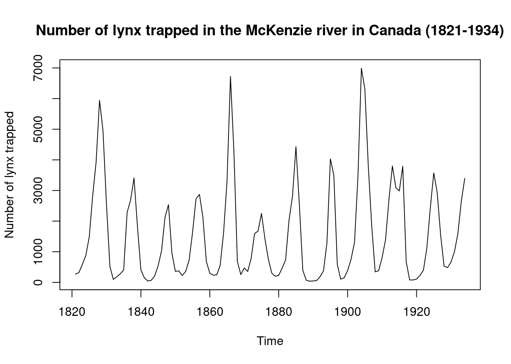
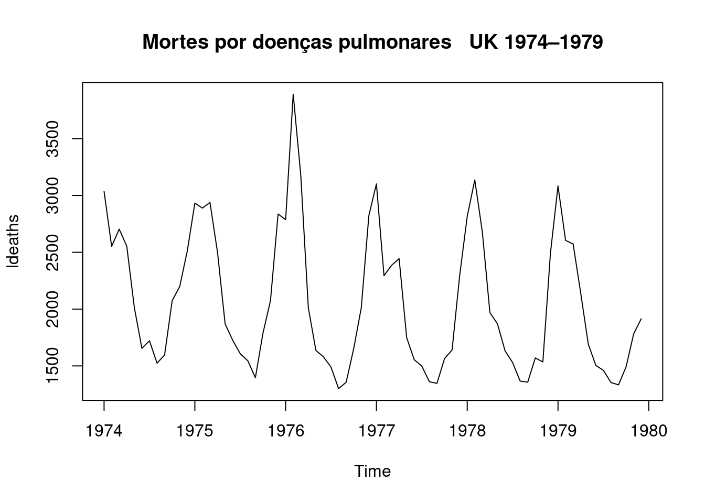
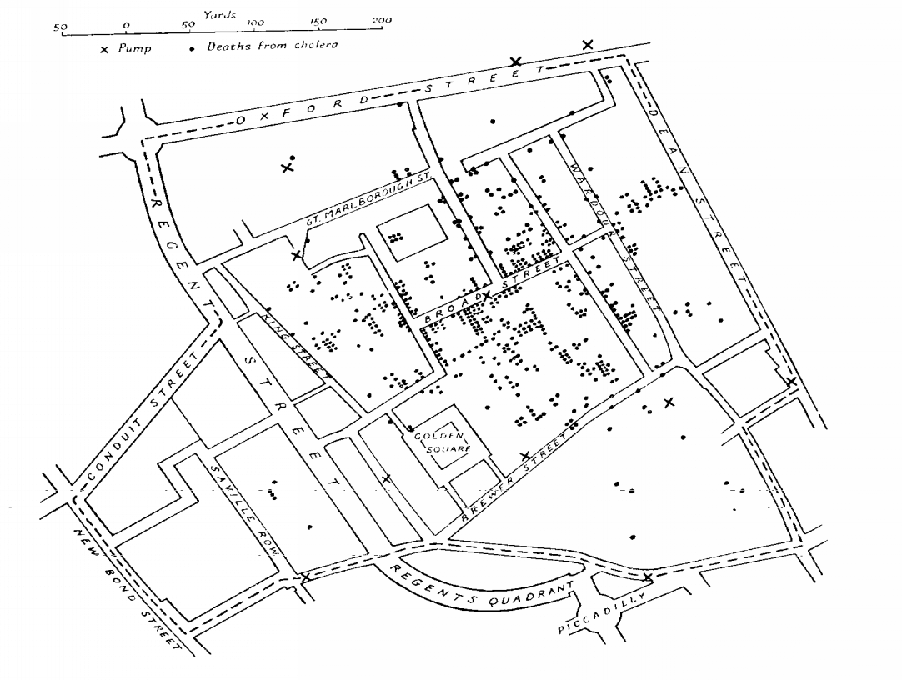
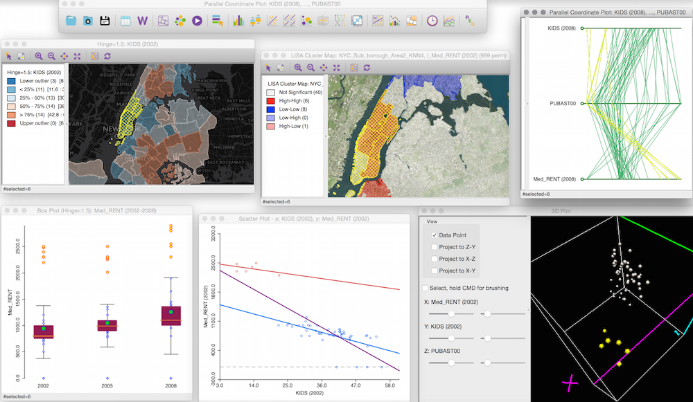

```{r setup, include=FALSE}
library(knitr)
library(rmdformats)

## Global options
options(max.print="75")
knitr::opts_chunk$set(echo=FALSE,
               cache=TRUE,
               prompt=FALSE,
               tidy=TRUE,
               comment=NA,
               message=FALSE,
               warning=FALSE,
               cache.lazy=FALSE)
knitr::opts_knit$set(width=75)

```

```{r klippy}
# Insert copy to clipboard buttons in HTML documents
# remotes::install_github("rlesur/klippy")
klippy::klippy(
  lang = c("r", "markdown"),
  all_precode = FALSE,
  position = c("top", "right"),
  color = "navyblue",
  tooltip_message = "copiar código",
  tooltip_success = "copiado!"
)

```

```{r}
## Color Format
colFmt <- function(x,color) {
  
  outputFormat <- knitr::opts_knit$get("rmarkdown.pandoc.to")
  
  if(outputFormat == 'latex') {
    ret <- paste("\\textcolor{",color,"}{",x,"}",sep="")
  } else if(outputFormat == 'html') {
    ret <- paste("<font color='",color,"'>",x,"</font>",sep="")
  } else {
    ret <- x
  }

  return(ret)
}
```

```{r echo=F, fig.align="center", out.width="90%"}


```

# Introdução às Séries Temporais

## O que são Séries Temporais ?

-   **Definição:** Entende-se por Séries Temporais (ST) todo e qualquer
    conjunto de dados (absolutos ou relativos, discretos ou contínuos),
    ordenados cronologicamente.

-   **Condição:** Esses dados seguem uma ordenação em função do tempo
    (dependência temporal).

-   Seguem abaixo alguns exemplos de séries temporais:

```{r echo=F, fig.align="center", out.width= "70%", fig.show='hold'}
knitr::include_graphics('figuras/ST1.png')
```

## Hipóteses básicas do estudo das séries temporais

-   Há um sistema causal relacionando as variáveis no tempo;

-   Tais hipóteses se baseiam no pressuposto de que as relações
    apontadas pela experiência pregressa permitem prever o possível
    comportamento das variáveis sob análise, determinando se seu
    comportamento apresenta propriedades determinísticas e/ou
    aleatórias.

+----------------------------------------+-----------------------------+
| **Objetivo**                           | **Exemplos**                |
+:======================================:+:===========================:+
| **Descrição:** Verificar existência de | Identificar tendência da    |
| tendência, sazonalidade, ciclos.       | AIDS; sazonalidade da       |
| Histogramas, boxplots, são ferramentas | dengue visando estabelecer  |
| da análise exploratória descritiva     | melhor período de           |
|                                        | intervenção.                |
+----------------------------------------+-----------------------------+
| **Estabelecimento de causalidade:**    | Vacina X sarampo;           |
| Estudo da relação de causa-efeito      | Mortalidade por DIC X       |
|                                        | melhor assistência          |
+----------------------------------------+-----------------------------+
| **Classificação:** Identificação de    | A série de leishmaniose     |
| padrões                                | tegumentar é "igual" à      |
|                                        | visceral ?                  |
+----------------------------------------+-----------------------------+
| **Controle:** sistemas dinâmicos,      | Modelar a resposta a        |
| caracterizados por uma entrada $X_t$,  | medidas de controle de      |
| uma série de saída $Z_t$ e uma função  | epidemia                    |
| de transferência $V_t$                 |                             |
+----------------------------------------+-----------------------------+
| **Monitoramento:** Detectar variações  | Dosagem de Hormônios ou de  |
| no comportamento da séries temporais   | sinais vitais em CTI        |
| conforme elas ocorram                  |                             |
+----------------------------------------+-----------------------------+
| **Predição (forecast):** Prever o      | Predição de epidemias       |
| comportamento futuro de uma serie      |                             |
+----------------------------------------+-----------------------------+
| **Atualização (nowcast):** Predição    | Corrigir atraso de          |
| sobre o presente                       | notificações                |
+----------------------------------------+-----------------------------+

## Estacionariedade

-   Uma série temporal é dita estacionária quando ela se desenvolve no
    tempo aleatoriamente ao redor de uma média constante e com uma
    variância constante, refletindo alguma forma de equilíbrio estável.
    
```{r echo=F, fig.align="center", out.width= "70%", fig.show='hold'}
knitr::include_graphics('figuras/ST2.png')
```

## Tendência

-   É a indicadora da direção global dos dados (ou movimento geral da
    variável), do percurso traçado e de sua linha contínua.
    
```{r echo=F, fig.align="center", out.width= "70%", fig.show='hold'}
knitr::include_graphics('figuras/ST3.png')
```

## Ciclo

* Os ciclos são oscilações (aproximadamente regulares) em torno da tendência. Podem dever-se a fenômenos naturais, socioculturais ou econômicos, como variações climáticas (ex: excesso ou falta de chuva pode produzir ciclos agrícolas)

* Variações que apesar de periódicas não são associadas automaticamente a nenhuma medida do calendário;

* Aumento ou redução de frequência sem intervalos fixos.

**Ex:** Ciclos Econômicos e Ciclos de epidemias.

```{r echo=F, fig.align="center", out.width= "70%", fig.show='hold'}

```

## Sazonalidade

* São ciclos de curto prazo (não maiores que um ano), em torno da tendência;

* Costumam se referir a eventos ligados a estação do ano, vinculados ao calendário e geralmente repetidos a cada doze meses;

* Efeitos ligados à variações periódicas (semanal, mensal, anual, etc.);

* Padrões que ocorrem em intervalos fixos.

**Ex:** Medidas de Temperatura (aumenta no verão e diminui no inverno).

```{r echo=F, fig.align="center", out.width= "70%", fig.show='hold'}

```

* A diferença entre os ciclos, propriamente ditos, e a sazonalidade é o período de avaliação (curto e longo);

* A semelhança é que ambos definem oscilações relativamente regulares em torno da tendência.

* Na área de saúde é pouco comum encontrarmos ciclos, ainda que possam existir.


## Termo Aleatório ou Ruído Branco

* Conceitualmente, a componente aleatória é uma mistura de pertubações bruscas, irregulares e esporádicas nos movimentos das séries que tipificam os fenômenos. Na realidade é resultante dos efeitos de múltiplas causas que dificilmente/não conseguem ser previstos.

Exemplos típicos de eventos aleatórios: Secas, Enchentes, Terremotos, Ocorrência de epidemias, Crise política, etc.

## Componentes de uma Série Temporal

```{r echo=F, fig.align="center", out.width= "70%", fig.show='hold'}
knitr::include_graphics('figuras/ST6.png')
```

* Decompondo a ST, teremos:

```{r echo=F, fig.align="center", out.width= "70%", fig.show='hold'}
knitr::include_graphics('figuras/ST7.png')
```

* A série pode ser descrita como sendo a soma ou multiplicação dos componentes (tendência, sazonalidade, ciclicidade - se houver - e termo aleatório).

$$Z_t = T_t + S_t + a_t$$

$$Z_t = T_t \times S_t \times a_t$$

```{r echo=F, fig.align="center", out.width= "70%", fig.show='hold'}
knitr::include_graphics('figuras/ST8.png')
```
## Pressuposto da Independência 

* Os métodos usuais de análise estatística de dados têm como pressuposto básico a independência dos eventos (casos). Ou seja, a ocorrência de um caso de doença em uma dada pessoa seria independente da ocorrência em outra pessoa.

* Pressupostos básicos para uma análise de regressão:

  * $E(e_i)=0$
  
  * Variância $\sigma^2$ constante (homocedasticidade)
  
  * $e_i \sim N(0, \sigma^2)$
  
  * $e_i \neq e_j$, são independentes

* Na análise da incidência de doenças (ou qualquer outro indicador ecológico) ao longo do tempo isso não é verdade: a incidência em um determinado dia/mês ou ano em geral é correlacionada com a ocorrência no dia/mês/ano anterior.

* Esta correlação é expressa em uma função denominada função de autocorrelação - FAC (*Autocorrelation function - ACF*).


## Função de Autocorrelação - FAC

* Abaixo, um exemplo de função de autocorrelação. Observe que há duas linhas horizontais que representam os limites do teste de significância sendo que valores acima ou abaixo da linha são estatisticamente significantes. Neste documento, apresentaremos o teste que é realizado.

```{r echo=F, fig.align="center", out.width= "70%", fig.show='hold'}
knitr::include_graphics('figuras/ST9.png')
```

* O correlograma é uma das principais ferramentas de análise exploratória em séries temporais, pois indica como cada valor em um dado instante de tempo $t$ se relaciona com os valores em $t+1, t+2, \dots t+j$. Sendo $H_0 : \rho_h = 0$
  
  
# https://ogcruz.github.io/Curso_eco_2021/introdu%C3%A7%C3%A3o-%C3%A0s-s%C3%A9ries-temporais.html


# Introdução à Análise Estatística Espacial

## O que é Análise Estatística Espacial ?

-   São métodos estatísticos que levam em consideração a localização
    espacial do fenômeno estudado;

-   Segundo Bailey & Gatrell (1995), *"Análise estatística espacial pode
    ser realizada quando os dados são espacialmente localizados e se
    considera explicitamente a possível importância de seu arranjo
    espacial na análise ou interpretação dos resultados"*

-   A primeira pergunta a ser feita é: A distribuição dos dados
    apresenta um padrão aleatório ou apresenta uma agregação definida
    (*clusters*) ?

```{r echo=F, fig.align="center", out.width= "70%", fig.show='hold'}
knitr::include_graphics('figuras/Cluster.png')
```

## Origem da Estatística Espacial

-   Dr. John Snow (1813-1858) $\rightarrow$ Considerado pai da
    Epidemiologia Moderna

```{r echo=F, fig.align="center", out.width= "60%", fig.show='hold'}

```

Mapeamento dos casos de coléra ($\bullet$) e as bombas de água (X) em
Londres, 1854.

```{r echo=F, fig.align="center", out.width= "30%", fig.show='hold'}

```

## Objetivos da Estatística Espacial

1)  Análise de padrões espaciais e espaço-temporais (ex: Análise
    Exploratória Espacial, Correlação Espacial)

2)  Modelagem Espacial (ex: Modelos Estatísticos de Regressão Espacial)

## Dependência Espacial ou Autocorrelação Espacial

-   "Independência é um pressuposto muito conveniente que faz grande
    parte da teoria estatística matemática tratável. Entretanto, modelos
    que envolvem dependência estatística são frequentemente mais
    realísticos. . . . Neste tipos de dados a dependência está presente
    em todas as direções e fica mais fraca a medida em que aumenta a
    dispersão na localização dos dados." (Cressie N.,1991)

-   *"Todas as coisas se parecem, coisas mais próximas são mais
    parecidas que aquelas mais distantes."* (Tobler, 1979).
    `r colFmt(" **Também conhecida como $1^a$ Lei da Geografia**",'red')`

## Tipologia dos Dados Espaciais

Os diferentes tipos de dados espaciais são tradicionalmente
classificados de acordo com uma tipologia. Esta caracterização diz
respeito a natureza estocástica da observação.

Noel Cressie (1993) divide a estatı́stica espacial em 3 grandes áreas:

i)  `r colFmt(" **Dados de processos pontuais**",'darkmagenta')`

ii) `r colFmt(" **Dados de geoestatística**",'darkmagenta')`

iii) `r colFmt(" **Dados de área**",'darkmagenta')`

Existem métodos estatı́sticos diferentes para descrever ou analisar estes
tipos de dados. Exemplo:

```{r echo=F, fig.align="center", out.width= "75%", fig.show='hold'}
include_graphics('figuras/slide4.jpg')

```

## Padrões Pontuais

-   O principal interesse está no conjunto de coordenadas geográficas
    representando as localizações exatas de eventos.

-   Exemplos: Localização de crimes, localização da residência dos casos
    de dengue, localização de espécies vegetais, etc.

-   Neste caso, o dado aleatório de interesse é a localização espacial
    do evento.

```{r echo=F, fig.align="center", message=FALSE, warning=FALSE, comments=NA, out.width="30%", comment=NA}
knitr::include_graphics('figuras/coordenadas.png')
```

```{r echo=F, fig.align="center", message=FALSE, warning=FALSE, comments=NA, out.width="70%", comment=NA}
knitr::include_graphics('figuras/pontos1.jpg')
```

```{r echo=F, fig.align="center", out.width= "55%", fig.show='hold'}

```

### Estimativas de Kernel (ou Mapas de Calor)

```{r echo=F, fig.align="center", out.width= "45%", fig.show='hold'}
knitr::include_graphics('figuras/kernel2.png')
```

-   Estimador de intensidade de distribuição de pontos:

$$\hat{\lambda}_{\tau}(u) = \dfrac{1}{\tau^2}\sum k(\dfrac{d(u_i , u)}{\tau}), d(u_i , u) \leq \tau$$
[\*Fonte: Referência científica: Druck, S.; Carvalho, M.S.; Câmara, G.;
Monteiro, A.V.M. (eds) "Análise Espacial de Dados Geográficos".
Brasília, EMBRAPA,
2004](http://www.dpi.inpe.br/gilberto/livro/analise/cap2-eventos.pdf)

```{r echo=F, fig.align="center", out.width= "60%", fig.show='hold'}

```

-   Localização da ocorrência de casos de dengue em Belo Horizonte/MG

```{r echo=F, fig.align="center", out.width= "50%", fig.show='hold'}
knitr::include_graphics('figuras/dengueBH.png')
```

## Geoestatística

-   Podemos definir como sendo uma análise de um atributo espacialmente
    contínuo amostrado em localizações fixas.

-   Os dados compreendem um conjunto de localizações (em geral latitudes
    e longitudes), mas atribuidos a eles uma medida, como por exemplo:
    volume de chuva, concentração de poluentes no ar, número de ovos de
    Aedes postado em ovitrampas, etc.

-   A determinação experimental do semivariograma, para cada valor de
    $x_i$, considera todos os pares de amostras $z(x)$ e $z(x+h)$,
    separadas pelo vetor distância $h$, a partir da equação:

```{r echo=F, fig.align="center", out.width= "25%", fig.show='hold'}
knitr::include_graphics('figuras/variograma3.png')
```

$$\hat{\gamma}(h) = \dfrac{1}{2N(h)}\sum^{N(h)}_{i=1}[z(x_i) - z(x_i + h)]^2 $$

-   Sendo $\hat{\gamma}(h)$ o semivariograma estimado e $N(h)$ o número
    de pares de valores medidos, $z(x)$ e $z(x+h)$, separados pelo vetor
    $h$.

```{r echo=F, fig.align="center", out.width= "40%", fig.show='hold'}
include_graphics('figuras/variograma1.png')
```

-   Esta fórmula, entretanto, não é robusta. Podem existir situações em
    que variabilidade local não é constante e se modifica ao longo da
    área de estudo (heteroscedasticidade).

```{r echo=F, fig.align="center", out.width= "40%", fig.show='hold'}
include_graphics('figuras/variograma2.png')
```

[\*Fonte: Referência científica: Druck, S.; Carvalho, M.S.; Câmara, G.;
Monteiro, A.V.M. (eds) "Análise Espacial de Dados Geográficos".
Brasília, EMBRAPA,
2004](http://www.dpi.inpe.br/gilberto/livro/analise/cap3-superficies.pdf)

-   **Exemplo:** Mapa sobre o teor de argila no solo.

```{r echo=F, fig.align="center", out.width= "70%", fig.show='hold'}
knitr::include_graphics('figuras/geoestatistica7.png')
```

## Dados de Área

-   Na análise de áreas o atributo estudado é em geral resultado de uma
    contagem ou uma medida de síntese (em geral somas ou médias) em uma
    determinada área bem definida, por exemplo um polígono.

-   Tal polígono cuja forma pode ser complexa bem como as relações de
    vizinhança.

-   O objetivo é a detecção e explicação de padrões e tendências
    observados entre áreas.

### Mapa Temático

-   Taxas de câncer de pulmão na população branca masculina nos Estados
    Unidos, por condados no ano de 1998

```{r echo=F, fig.align="center", out.width="70%"}
knitr::include_graphics('figuras/area1_2019.png')
```

### Matriz de Vizinhança

```{r echo=F, fig.align="center", out.width="55%"}

```

### Moran Global, Moran Local e Lisa Map

```{r echo=F, fig.align="center", out.width="20%", fig.cap="Moran Global"}

```

```{r echo=F, fig.align="center", out.width="30%", fig.cap="Moran Local"}

```

-   Desigualdade no nível distrital na cobertura de saúde reprodutiva,
    materna, neonatal e infantil na Índia

```{r echo=F, fig.align="center", out.width="90%"}
knitr::include_graphics('figuras/moran_local2.png')
```

[Fonte: PANDA, Basant Kumar; KUMAR, Gulshan; AWASTHI, Ashish. District
level inequality in reproductive, maternal, neonatal and child health
coverage in India. BMC public health, v. 20, n. 1, p. 1-10,
2020.](https://bmcpublichealth.biomedcentral.com/articles/10.1186/s12889-020-8151-9)

### Modelos de Regressão Espacial

-   `r colFmt(" Hipótese de independência das observações em geral é Falsa ",'orange')`
    $\rightarrow$ Dependência Espacial

-   Efeitos Espaciais $\rightarrow$ Se existir forte tendência ou
    correlação espacial, os resultados serão influenciados, apresentando
    associação estatística onde não existe (e vice-versa);

-   `r colFmt("**Como verificar ?** ",'darkred')` $\rightarrow$ Medir a
    autocorrelação espacial dos resíduos da regressão (Índice de Moran
    dos resíduos).

-   Autocorrelação espacial constatada ! E agora ? $\rightarrow$
    Utilizar Modelos de regressão que incorporam efeitos espaciais:

    i)  **Modelos Globais:** utilizam um único parâmetro para capturar a
        estrutura de correlação espacial $\rightarrow$ ex: *Spatial
        Error Models (CAR)*

$$y_i = \beta_0 + \sum^{p}_{k} \beta_k x_{ik}  + \varepsilon_i \text{    , sendo  }  \varepsilon_i = \lambda  W + \xi$$

-   Os efeitos da autocorrelação espacial são associados ao termo de
    erro. Sendo $W$ a matriz de vizinhaça, $\varepsilon$ a componente do
    erro com efeitos espaciais, $λ$ é o coeficiente autoregressivo e
    $\xi$ é a componente do erro com variância constante e não
    correlacionada.

-   A hipótese nula para a não existência de autocorrelação é que
    $\lambda = 0$, ou seja, o termo de erro não é espacialmente
    correlacionado.

    ii) **Modelos Locais:** parâmetros variam continuamente no espaço
        ex: *Geographically Weighted Regression (GWR)*

$$y_i = \beta_{0}(u_i, v_i) + \sum^{p}_{k}  \beta_k (u_i, v_i) x_{ik} + \varepsilon_i \text{    , sendo  } (u_i, v_i) \text{    as coordenadas geográficas}$$
[Fonte: ARDILLY, Pascal et al. Manuel d'analyse spatiale.
2018.](https://ec.europa.eu/eurostat/documents/3859598/9462709/INSEE-ESTAT-SPATIAL-ANA-18-EN.pdf)

## Como trabalhar com Análise Estatística Espacial: Algumas ferramentas

### SiG QGIS

```{r echo=F, fig.align="center", out.width="60%"}
knitr::include_graphics('figuras/QGIS.png')
```

[QGIS: Um Sistema de Informação Geográfica livre e
aberto](https://www.qgis.org/pt_BR/site/)

### GEODA

```{r echo=F, fig.align="center", out.width="70%"}

```

[GEODA: AN INTRODUCTION TO SPATIAL DATA
ANALYSIS](https://spatial.uchicago.edu/geoda)

### R

```{r echo=F, fig.align="center", out.width="50%"}

```

Fonte: [Dicas para integração e instalação do R 4.0 no Ubuntu 20.04 LTS
e os pacotes
espaciais](https://rtask.thinkr.fr/installation-of-r-4-0-on-ubuntu-20-04-lts-and-tips-for-spatial-packages/)

# Serão feitas duas aplicações de Estatística Espacial utilização o pacote estatístico R:

## Aplicação I: Construindo mapas a partir da biblioteca geobr

-   Bibliotecas que serão utilizadas:

```{r, echo=T}
library(ggplot2)
library(dplyr)
library(viridis)
library(geobr)
library(sf)
library(maptools)
library(leaflet)
library(ggspatial)

```

-   Para acessar os dados dos limites territoriais de todos os estados
    brasileiros é necessário utilizar a função *read_state*.

```{r, echo=T}
brasil.ufs <- read_state(code_state = "all", year=2019, showProgress = FALSE)
```

-   Primeiro, vamos fazer um gráfico apenas com as geometrias.

```{r, echo=T}
ggplot(brasil.ufs) + 
  geom_sf()
```

-   Para a construção de um mapa onde cada estado recebe uma cor de
    acordo com a sua região geogrática, procedemos da seguinte forma:

```{r, echo=T,  out.width="70%"}
ggplot(brasil.ufs) + 
  geom_sf(aes(fill = name_region)) + 
  labs(fill="Região")
```

-   Agora utilizaremos dados relativos a porcentagem de municípios com
    rede de esgoto de acordo com a unidade da federação ([fonte dos
    dados](https://pt.wikipedia.org/wiki/Lista_de_unidades_federativas_do_Brasil_por_acesso_%C3%A0_rede_de_esgoto)
    ) para fazer um gráfico. Vamos associar esses dados a tabela de
    acordo com a variável State e padronizaremos a porcentagem para
    variar de 0 a 100.

```{r, echo=T,  out.width="70%"}
acesso_san <- data.frame(code_state = c(12, 27, 16, 13, 29, 23, 53, 32, 52, 21, 51, 50, 31, 15, 
                                   25, 41, 26, 22, 33, 24, 43, 11, 14, 42, 35, 28, 17), 
                         com_rede = c(0.273, 0.412, 0.313, 0.177, 0.513, 0.696, 1.000, 0.974, 0.280, 0.065, 
                                      0.191, 0.449, 0.916, 0.063, 0.731, 0.421, 0.881, 0.045, 0.924, 0.353, 
                                      0.405, 0.096, 0.400, 0.352, 0.998, 0.347, 0.129))

brasil.ufs |> 
  left_join(acesso_san, by = "code_state") |> 
  mutate(com_rede = 100*com_rede) |> 
  ggplot(aes(fill = com_rede), color = "black") +
    geom_sf() + 
    scale_fill_viridis(name = "Municípios com rede de esgoto (%)", direction = -1) + 
  xlab("Longitude") + 
  ylab("Latitude") +
  annotation_scale(location = "bl") +
  annotation_north_arrow(location = "br") +
    theme_minimal()
```

-   Uma forma alteranativa de apresentar esses mesmos dados se dá pela
    apresentação de círculos com raios proporcionais a porcentgem de
    municípios com rede de esgoto no centroide de cada geometria (nesse
    caso, UF).

```{r, echo=T,  out.width="70%"}
coord_pontos <- brasil.ufs |> 
                  left_join(acesso_san, by = "code_state") |> 
                  mutate(com_rede = 100*com_rede) |> 
                  st_centroid()

ggplot(brasil.ufs)+ 
  geom_sf() + 
  geom_sf(data = coord_pontos, aes(size = com_rede), col = "blue", alpha = .65,
          show.legend = "point") + 
  scale_size_continuous(name = "Municípios com rede de esgoto (%)") + 
  xlab("Longitude") + 
  ylab("Latitude") +
  annotation_scale(location = "bl") +
  annotation_north_arrow(location = "br") +
    theme_minimal()
```

-   Uma alternativa interativa para trabalhar com mapas é com a
    utilização do pacote *leaflet*

```{r, echo=T,  out.width="70%"}
data.frame(st_coordinates(coord_pontos), 
           com_rede = coord_pontos$com_rede, 
           UF = coord_pontos$name_state) |>
  leaflet() |> 
    addTiles() |>
    addCircleMarkers(~ X, ~ Y,
                     label = ~ as.character(paste0(UF, ": ", com_rede, "%")),
                     labelOptions = labelOptions(textsize = "13px"),
                     radius = ~ com_rede/10,
                     fillOpacity = 0.5)
```

[Créditos ao Thiago Mendonça](https://www.tiagoms.com/post/mapa/)

------------------------------------------------------------------------

## Aplicação II: Análise exploratória utilizando os dados de dengue em Dourados/MS

-   Nesta apresentação serão utilizados os dados que fizeram parte da
    dissertação de [Isis Rodrigues
    Reitman](https://sucupira.capes.gov.br/sucupira/public/consultas/coleta/trabalhoConclusao/viewTrabalhoConclusao.jsf?popup=true&id_trabalho=3666174)
    intitulada *"SAÚDE E AMBIENTE URBANO: A RELAÇÃO DE INCIDÊNCIA DE
    DENGUE E AS DISPARIDADES ESPACIAIS EM DOURADOS -- MS"*, apresentada
    no [Programa de Pós-Graduação em Geografia da Universidade Federal
    da Grande
    Douradosos/MS](https://portal.ufgd.edu.br/pos-graduacao/mestrado-doutorado-geografia/index),
    em abril de 2016.

-   Essa aplicação também se encontra no [Curso de Estudos
    Ecológicos](https://ogcruz.github.io/) ministrado para o curso de
    [Pós-Graduação em Epidemiologia em Saúde
    Pública](http://ensino.ensp.fiocruz.br/cursos/mestrado-e-doutorado/epidemiologia-em-saude-publica)
    em 2019, pelos pesquisadores [Oswaldo Gonçalves Cruz
    (PROCC/FIOCRUZ)](https://lsbastos.github.io/PROCC/membro-9530671289607786.html)
    e [Wagner Tassinari
    (DEMAT/ICE/UFRRJ)](https://institucional.ufrrj.br/ruralpesquisa/wagner-de-souza-tassinari/)

**OBS:** Os dados e as malhas geográficas utilizadas nessa apresentação,
estão disponíveis no seguinte endereço:
([link](https://github.com/wtassinari/espacial2021))

-   Biliotecas do R que serão utilizadas

```{r, echo=T}

library(readr)
library(tidyverse)
library(sf)
library(maptools)
library(spatstat)
library(tmap)
```

-   Lendo a tabela da população por setor censitário e os shapes files
    do contorno e por setor censitário de Dourados/MS

```{r, echo=T}
unzip('dados/pop2010.zip', exdir='dados')
pop2010 <- read_csv('dados/pop2010.csv')

unzip('malhas/Setor_UTM_SIRGAS.zip', exdir='malhas')
setor.sf <- read_sf('malhas/Setor_UTM_SIRGAS.shp', crs = 31981)

unzip('malhas/contorno.zip', exdir='malhas')
contorno.sf <- read_sf('malhas/contorno.shp', crs = 31981)

```

**OBS:** Um aspecto muito importante dos dados espaciais é o sistema de
referência de coordenadas (CRS) que é usado. Por exemplo, uma
localização de (140, 12) não é significativa se você sabe onde está a
origem e se a coordenada x está a 140 metros, quilômetros ou talvez
graus de distância dela (na direção x).
([link](https://rspatial.org/raster/spatial/6-crs.html))

-   Fazendo um join com as tabelas com os setores censitários +
    população

```{r, echo=T}
setor.sf <- setor.sf %>% mutate (idsetor = as.numeric(CD_GEOCODI)) %>% inner_join(pop2010,by='idsetor')
```

-   Lendo e plotando os casos de dengue georreferenciados em Dourados/MS

```{r, echo=T}
unzip('dados/dengue_dourados.zip', exdir='dados')
casos <- read_csv('dados/dengue_dourados.csv')
casos.sf <- st_as_sf(casos, coords = c("X", "Y"), crs = 31981)
```

```{r, echo=T, out.width="60%"}
ggplot(setor.sf) + 
  geom_sf(fill = 'white', color='black') +
  geom_sf(data=casos.sf, color='red',size=1) +
  theme_void()
```

-   Lendo e plotando os os pontos de coleta de lixo georreferenciados em
    Dourados/MS

```{r, echo=T}
unzip('dados/lixo_dourados.zip', exdir='dados')
lixo <- read_csv2('dados/lixo_dourados.csv')
lixo.sf <- st_as_sf(lixo, coords = c("X", "Y"), crs = 31981)
```

```{r, echo=T,  out.width="70%"}
ggplot(setor.sf) + 
  geom_sf(fill = 'white', color = 'black') +
  geom_sf(data=lixo.sf,color='blue',size=1) +
  theme_void()
```

Como podemos observar, existem alguns pontos de coleta de lixo fora do
contorno de Dourados/MS

-   Uma forma de ficarmos só com os pontos dentro do polígono é
    utilizando o comando st_intersection.

```{r, echo=T}
lixo2.sf <- st_intersection(contorno.sf, lixo.sf)
```

```{r, echo=T,  out.width="70%"}
ggplot(setor.sf) + 
  geom_sf(fill = 'white', color = 'black') +
  geom_sf(data=lixo2.sf,color='blue',size=1) +
  theme_void()
```

-   Utilizando as informações dos casos (pontos) + do lixo (ponto) +
    população de cada setor censitário (mapa temático)

```{r, echo=T,  out.width="70%"}
ggplot(setor.sf) + 
  geom_sf(aes(fill=pop)) + 
  geom_sf(data=casos.sf,color='red',size=0.7, aes(colour = "Caso"), 
          show.legend = "point") +
  geom_sf(data=lixo2.sf,color='salmon',size=1, aes(colour = "Lixo"), 
          show.legend = "point") +
  scale_fill_distiller(palette ="PuBu", direction = 1) +
  scale_colour_manual(values = c("Caso" = "red", "Lixo" = "slamon")) +
  theme_minimal()
```

-   Agora serão construidos buffers de 500m de distância ao redor de
    cada ponto de coleta de lixo. Isso é interessante para verificar se
    os casos de dengue ocorrem em um raio de até 500m de distância dos
    pontos de coleta de lixo. Ou seja, a pergunta é, será que a
    distância dos pontos de coeta de lixo influenciam a ocorrência do
    caso de dengue ?

**Buffers:** São polígonos que contornam um objeto a uma determinada
distância. Sua principal função é materializar os conceitos de "perto" e
"longe".

```{r, echo=T,  out.width="70%"}
lixo_buffer <- st_buffer(lixo2.sf, 500) 

ggplot(setor.sf) + 
  geom_sf(aes(fill=pop)) + 
  geom_sf(data=lixo_buffer,color='gray', fill = "transparent", size=0.4) +
  geom_sf(data=casos.sf, color='red',size=0.7) +
  scale_fill_distiller(palette ="PuBu", direction = 1) +
  scale_colour_manual(values = c("Caso" = "red", "Lixo" = "slamon")) +
  theme_minimal()
```

-   Represntando os casos e o lixo de forma interativa

```{r, echo=T,  out.width="90%"}
tm_shape(setor.sf) +  tm_borders("black") +
  tm_shape(casos.sf) + tm_dots("red") +
  tm_shape(lixo.sf) + tm_dots("green") +
  tm_shape(lixo_buffer) + tm_borders("blue") +
  tmap_mode("view")
```

-   Convertendo o dado de pontos (padrão pontual) para dados de área

```{r, echo=T}
## conta casos por setor 
casos.sf$contador <- 1 
casos <- setor.sf |>  
  st_join(casos.sf) |> 
  filter(CLASSI_FIN == 1) %>%  ## seleciona somente os casos confirmados
  group_by(ID) |> 
  summarise(casos = sum(contador))

st_geometry(casos) <- NULL  ## remove atributos de geometria

## numero de depositos de Lixo por setor 
lixo.sf$contador <- 1 

lixo <- setor.sf |>  
  st_join(lixo.sf) |> 
  group_by(ID) |> 
  summarise(lixo = sum(contador))

st_geometry(lixo) <- NULL ## remove atributos de geometria

# Inserindo as contagens dos casos e de pontos de coleta de lixo no atributo com a geometria.
setor.sf <- setor.sf |> 
  left_join(lixo,by = 'ID') |> 
  left_join(casos,by = 'ID') 
```

-   Plotando o mapa temático dos casos por setor censitário

```{r, echo=T,  out.width="70%"}
plot(setor.sf['casos'])
```

-   Plotando o mapa temático dos pontos de coleta de lixo por setor
    censitário

```{r, echo=T,  out.width="70%"}
plot(setor.sf['lixo'])
```

-   Calculando a taxa de incidência e plotando o mapa temático dos
    pontos de coleta de lixo por setor censitário

```{r, echo=T,  out.width="70%"}
setor.sf$tx <- (setor.sf$casos/setor.sf$pop) * 1000
setor.sf$tx[is.na(setor.sf$tx)] <- 0 # Transformando os missings em zero

summary(setor.sf$tx)
```

-   Plotando a distribuição da incidência em Dourados/MS

```{r, echo=T,  out.width="70%"}
library(wesanderson)
pal <- wes_palette("Moonrise3", 20, type = "continuous")

ggplot(setor.sf) + 
  geom_sf(aes(fill = tx), color = 'black') +
  scale_fill_gradientn(colours = pal) +
  ggtitle("Taxa de incidência de Dengue") + 
  theme_void()
```

-   Kernel por atributos

Vamos plotar o kernel por atributos referente a taxa de incidência de
dengue em Dourados/MS.

Primeiramente é necessário dissolver os polígonos em formato sf para
obter o contorno. Nesse caso queremos preservar o atributo AREA

```{r, echo=T,  out.width="70%"}
dourados.contorno <- st_union(setor.sf)
plot(dourados.contorno)
```

```{r, echo=T,  out.width="70%"}
dourados.w <- as.owin(st_geometry(dourados.contorno))
```

-   Extraindo os centróides dos polígonos em Dourados/MS

```{r, echo=T,  out.width="70%"}
centroides <- st_centroid(st_geometry(setor.sf))

# Transformando em os centróides em formato sp
centroides.sp <- as.data.frame(as_Spatial(centroides))
names(centroides.sp) <- c('X','Y')

plot(centroides.sp)
```

-   Colocando os pontos no formato sp

```{r, echo=T,  out.width="70%"}
centroides.ppp <- ppp(centroides.sp$X,centroides.sp$Y, dourados.w)

plot(centroides.ppp,pch=19,cex=0.5)
```

-   Fazendo o kernel por atributo da taxa de detecção

```{r, echo=T,  out.width="70%"}
kernel.tx <- density(centroides.ppp, 500, weights = setor.sf$tx, scalekernel = TRUE)
plot(kernel.tx)
```

-   Construindo a matriz de vizinhança para verificar a autocorrelação
    espacial

```{r, echo=T,  out.width="70%"}
library(spdep)
viz <- poly2nb(setor.sf)
viz 
```

-   Iremos precisar da coordenadas dos centróides

```{r, echo=T,  out.width="70%"}
setor.sp <- as(setor.sf, 'Spatial') # convertendo em formato sp
coord <- coordinates(setor.sp) # coordenadas dos centroidas dos poligonos de dourados
class(setor.sp)
```

-   Verificando a malha de conectividade da vizinhança de Dourados/MS

```{r, echo=T,  out.width="70%"}
viz.sf <- as(nb2lines(viz, coords = coord), 'sf')
viz.sf <- st_set_crs(viz.sf, st_crs(setor.sf))

# Plota o grafo de conectividade por contiguidade
mapa.viz <- ggplot(setor.sf) + 
  geom_sf(fill = 'salmon', color = 'white') +
  geom_sf(data = viz.sf) +
  theme_minimal() +
  ggtitle("Vizinhança por \n conectividade") +
  ylab("Latitude") +
  xlab("Longitude")
mapa.viz
```

-   Obtendo a correlação da taxa de incidência de dengue Dourados/MS

```{r, echo=T,  out.width="70%"}
pesos.viz <- nb2listw(viz)
moran.test(setor.sf$tx, pesos.viz)
```

-   Plotando o correlograma

```{r, echo=T,  out.width="70%"}
correl <- sp.correlogram(viz, setor.sf$tx, order = 8, method = "I")
correl
```

```{r, echo=T,  out.width="70%"}
plot(correl)
```

-   Mapeando os polígonos que tiveram os p-valores mais significativos
    no Moran Local.

```{r, echo=T,  out.width="70%"}
setor.sf$pval <- localmoran(setor.sf$tx, pesos.viz)[,5]

tm_shape(setor.sf) + 
  tm_polygons(col='pval', title="p-valores", breaks=c(0, 0.01, 0.05, 0.10, 1), border.col = "white", palette="-Oranges") +
  tm_scale_bar(width = 0.15) 
```

-   Moran Local (Lisa Map) da taxa de incidência Dourados/MS

```{r, echo=T,  out.width="70%"}
resI <- localmoran.sad(lm(setor.sf$tx ~ 1), 1:length(viz), viz, style = "W")
summary(resI)[1:10,]
```

```{r, echo=T,  out.width="70%"}
setor.sf$MoranLocal <- summary(resI)[,1] 

library(scales)

ggplot(setor.sf) + 
  geom_sf(aes(fill = MoranLocal), color = 'black') +
  scale_fill_gradientn(colours=c("blue", "white", "red"), 
                       values=rescale(c(min(setor.sf$MoranLocal), 0, max(setor.sf$MoranLocal))), guide="colorbar") + 
  ggtitle("Moran local") + 
  theme_void()
```

## Bibliografia sugerida

-   Druck, S.; Carvalho, M.S.; Câmara, G.; Monteiro, A.V.M. (eds).
    [Análise Espacial de Dados
    Geográficos](http://www.dpi.inpe.br/gilberto/livro/analise/).
    Brasília, EMBRAPA, 2004.

-   Interactive Spatial Data Analysis by Trevor C. Bailey , Anthony C.
    Gatrell Routledge, 1995

-   Applied Spatial Statistics for Public Health Data; Lance A. Waller,
    Carol A. Gotway Wiley-Interscience 1St ed. 2004

-   Applied Spatial Data Analysis with R; Roger S. Bivand, Edzer Pebesma
    , Virgilio Gomez-Rubio Springer; Edição: 2nd ed. 2013

-   Geocomputation with R by Robin Lovelace, Jakub Nowosad and Jannes
    Muenchow. [Geocomputation with
    R](https://geocompr.robinlovelace.net/), 2021.

# Programa de Pós-Graduação em Epidemiologia em Saúde Pública (ENSP/FIOCRUZ)

-   Programa de Pós-Graduação em Epidemiologia em Saúde Pública
    (ENSP/FIOCRUZ)
    [link](http://ensino.ensp.fiocruz.br/cursos/mestrado-e-doutorado/epidemiologia-em-saude-publica))

```{r echo=F, fig.align="center", out.width="80%"}

```

# Programa de Pós-Graduação em Ciências Veterinárias (IV/UFRRJ)

-   Programa de Pós-Graduação em Ciências Veterinárias (IV/UFRRJ)
    [link](http://cursos.ufrrj.br/posgraduacao/ppgcv/)

```{r echo=F, fig.align="center", out.width="80%"}
include_graphics('figuras/programa_veterinaria.png')
```

# Programa de Pós-Graduação em Estatística Aplicada (DEMAT/ICE/UFRRJ)

-   Programa de Pós-Graduação em Estatística Aplicada (DEMAT/ICE/UFRRJ)
    [link](http://cursos.ufrrj.br/posgraduacao/ppgeap/)

```{r echo=F, fig.align="center", out.width="80%"}

```

# Obrigado !!!!!

```{r echo=F, fig.align="center", out.width="90%"}
include_graphics('figuras/Obrigado.png')
```
